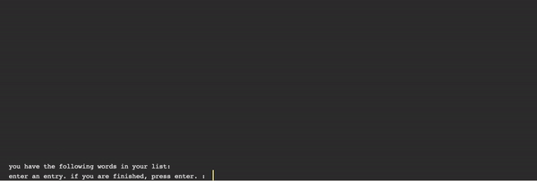
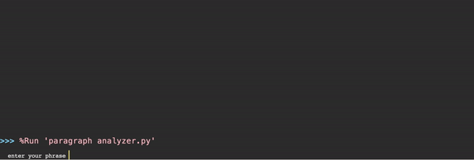
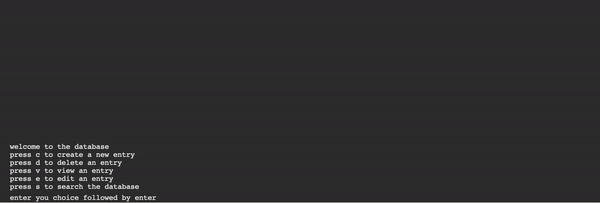

# data-organizers
- Set of data organizer codes
# alphabetizer
- Data organizing code
- Alphabitizes set of data based on first letter.

# paragraph analyzer
- Data analyzing code
- Gives word count, characters with and without spaces of a paragraph

# randomizer
- Random data generator code
- Prints a random word from set of inputted data

# database
- Short term storage code
- Short term storage program, create folders within program, store and delete text data in folders, search for data in folders, limit 12 folders, all data erased when program restarted.

# todo organiser
- Short term storage code
- Same as database^ except runs on command line interface
# text file todo organizer
- Long term storage code
- Same as todo organizer^ except stores data in text file, data is not erased after program is rerun.
